<div align="center">

<!-- HEADER SVG — typing animation + orbit -->


</div>

---

<div align="center">

### 🌐 Connect with me

[](https://t.me/GG_LOLIMNOTDIE_GG)
[](https://www.linkedin.com/in/farrux-nurmetov-a031493a0/)
[](mailto:nfarrux2197@gmail.com)

</div>

---

## ⚡ Skills

<!-- SKILLS SVG — animated progress bars -->


<br/>

### 🛠 Tech Stack

**Backend**


**Frontend**


**Databases & DevOps**


---

## 📊 GitHub Stats

<div align="center">


&nbsp;


</div>

<div align="center">


</div>

---

## 🐍 Contribution Snake

<!-- SNAKE SVG — animated snake eating contributions -->
<div align="center">

</div>

> **Note:** For a live auto-updating snake, add this GitHub Action to your repo:
>
> `.github/workflows/snake.yml` → uses `Platane/snk` action to generate real contribution data.
> Then replace `./snake.svg` with:
> `https://raw.githubusercontent.com/nfarrux2197/nfarrux2197/output/github-contribution-grid-snake-dark.svg`

---

## 🗂 Featured Projects

| Project | Description | Stack | Status |
|---|---|---|---|
| 🛒 **E-Commerce API** | Full REST API with JWT auth, filters, pagination | Django · DRF · Postgres | ✅ Shipped |
| 🤖 **Telegram Bot** | Async bot with Redis queues, webhook, Docker deploy | Python · aiogram · Redis | ✅ Shipped |
| 📊 **Analytics Dashboard** | Real-time dashboard with Celery background tasks | Flask · Celery · Chart.js | 🔧 WIP |
| 🔗 **URL Shortener** | Short-link service with click analytics, custom slugs | Flask · Redis · SQLite | ✅ Shipped |

---

<div align="center">

```
╔══════════════════════════════════════╗
║  Always building. Always learning.  ║
╚══════════════════════════════════════╝
```

*Made with* ❤️ *from Uzbekistan 🇺🇿*

</div>
